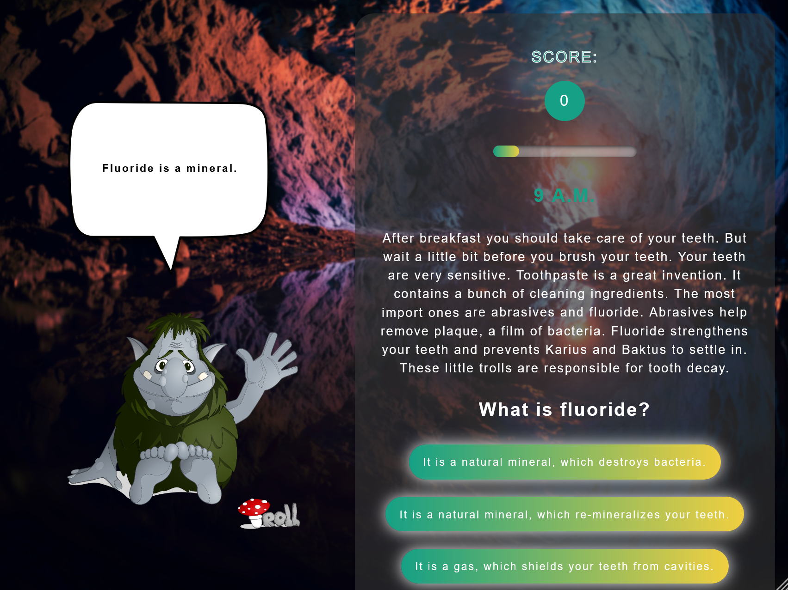
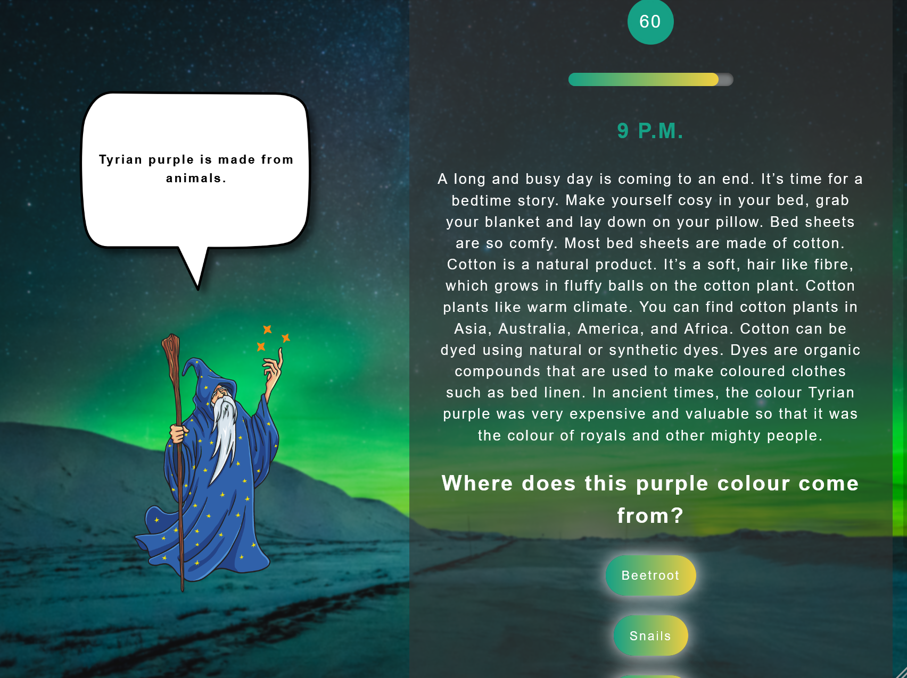
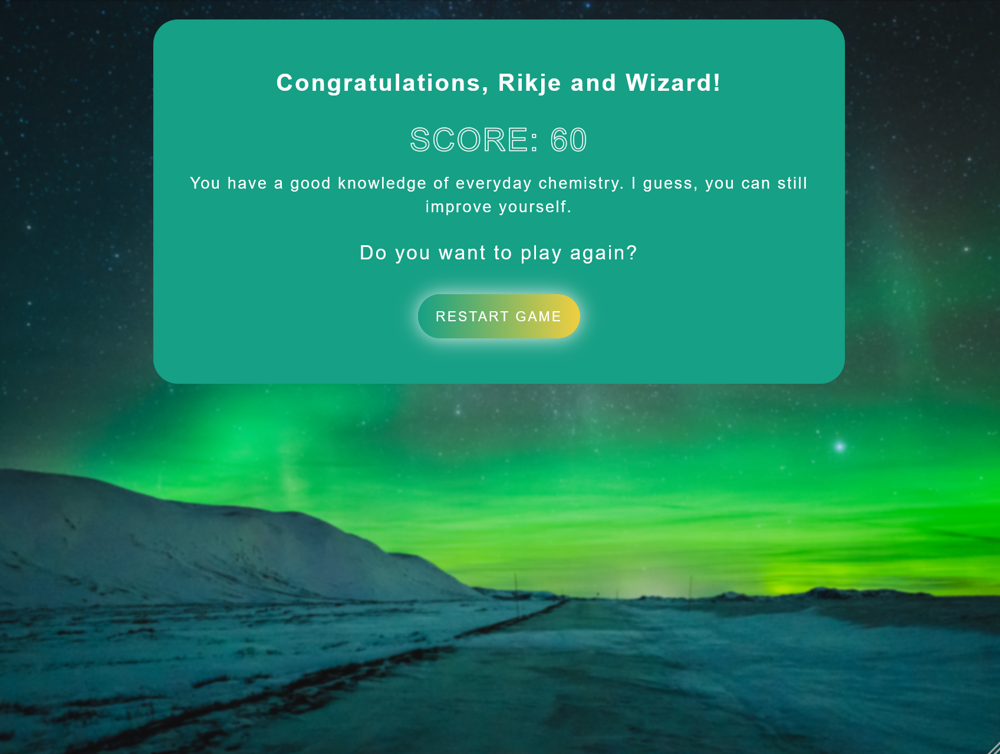

# The Everyday Chemistry Game

## Description

The Everyday Chemistry Game is an educational app that teaches kids and adults alike everyday chemistry. During the game-based multiple choice quiz the kids will discover that they are surrounded by chemistry in many areas of their daily life. They can choose a "virtual friend" who gives them hints.

## Tech stack

- Vue 3
- Vuex
- TypeScript
- SCSS

## Impressions

**Tablet**

    

## Project setup

```
yarn install
```

### Compiles and hot-reloads for development

```
yarn serve
```

### Compiles and minifies for production

```
yarn build
```

### Lints and fixes files

```
yarn lint
```

### Customize configuration

See [Configuration Reference](https://cli.vuejs.org/config/).
